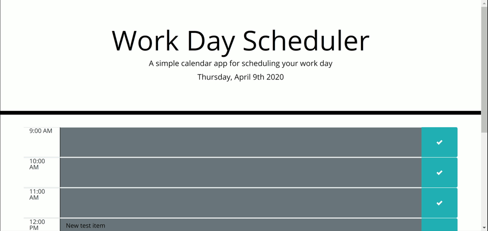

# Work Day Scheduler Challenge

## Purpose
Create a daily scheduler that presents blocks of hours from 9:00 AM to 5:00 PM. Color blocks are color coded with grey indicating the past, red indicating the current hour, and green indicating the future. Users click on a text area, enter their event, and hit the save button which stores the event to local storage. When the new day begins, events from the past day are no longer viewable.

## Website
The actual website can be viewed at the [following link](https://aelisker.github.io/workday-scheduler/). The code repository can be found at [here](https://github.com/aelisker/workday-scheduler/).

You can also find a screenshot of the website below:

